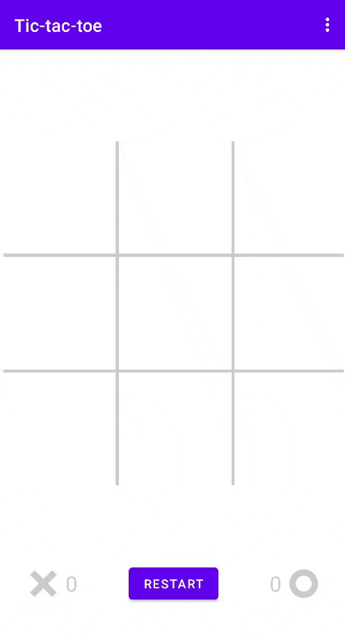

# Advanced tic-tac-toe for custom fields

This implementation of tic-tac-toe allows to play against advanced AI on a field of custom size. The development of this
app was started as part of a test task, and its code is distributed under the Apache License 2.0. Feel free to use it 
for any purpose.

In order to maintain playability on very large fields, a small change in gameplay was required. A player must collect
a combo of only 5 marks in a row on a field of size 6 or more (see the gif above for an example). It seems to me that
this is the only version of the game that is exciting. The limited size of the combo on a large field creates a wide
scope of possible strategies and makes the game tense.

## Implementation details

### App

The app is divided into several layers: model (core), view and view-model.

The model (core) is hosted in the separate gradle module and written in pure JavaTM. This module contains
the essential game logic and is independent of other parts of the app.

The view layer consists of a set of different Fragments controlled by a NavController. This layer is only for
displaying events occurring in the view-model. There is no logic in it.

The view-model is a layer between the model (core) and the view. Only this layer can directly call the methods of the
model (core) and respond to events occurring in it.

Such structure reduces the number of dependencies and makes it easier to extend the app. For example, described 
organization of layers simplifies the work with the lifecycle of Activity in Android. Since the view-model is separate 
from the view layer (Activities and Fragments) and does not depend on its lifecycle, when an Activity is recreated (for
example, when the screen is rotated), information about the current state of the game can be easily restored from
the view-model.

### AI

AI is based on the MTD(f) algorithm described by Aske Plaat[\[1\]](#references). This is an advanced version
of the Minimax[\[2\]](#references) algorithm with a dynamically expanding search window for alpha-beta
pruning[\[3\]](#references). Also, this algorithm actively uses memory for caching intermediate results in
the process of dynamically increasing the depth of analysis of game state tree.

The MTD(f) algorithm assumes a sequential increase in the search depth, starting from depth 1. With each step of
increasing the depth, the accuracy of the analysis increases, but the complexity grows exponentially. Caching of
intermediate results and implementation of the transposition table (Zobrist hashing[\[4\]](#references) is
used) in the core of the game help to significantly speed up the algorithm. But in the end, the algorithm is still
limited in execution time. When the limited analysis time has elapsed, this AI returns the move that best matches the
given heuristic at the achieved search depth.

The quality of the final result of this algorithm on large fields depends entirely on the quality of the heuristic,
which is calculated when the maximum search depth is reached. The version of the heuristic designed in this
implementation gives a good result. But there is no limit to perfection. If you can find a better option please let me
know and share with the community.

AI works in a separate thread.

### Code optimization

The core of the game is written in pure JavaTM and can be easily ported from AndroidTM to any 
other platform.

The core is optimized to avoid autoboxing and re-creation of various objects as much as possible. Fast HashMaps with
primitive keys are used from the `fastutil` package. Freezes during garbage collection and smooth gameplay are
incompatible things. Everything is written in such an approach that the garbage collector can go on vacation.

## References

Here you can find links to additional resources if you are interested in learning more about the algorithmic details 
behind the app. In addition, the code itself has very detailed comments.

1. [Aske Plaat: MTD(f), a new chess algorithm](https://people.csail.mit.edu/plaat/mtdf.html)
2. [Minimax](https://en.wikipedia.org/wiki/Minimax)
3. [Alpha–beta pruning](https://en.wikipedia.org/wiki/Alpha%E2%80%93beta_pruning)
4. [Zobrist hashing](https://en.wikipedia.org/wiki/Zobrist_hashing)
